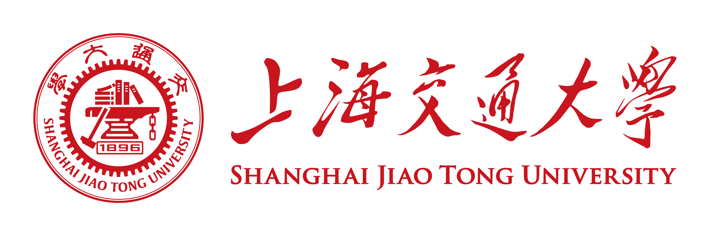
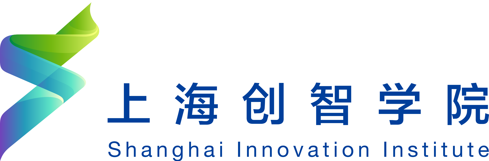
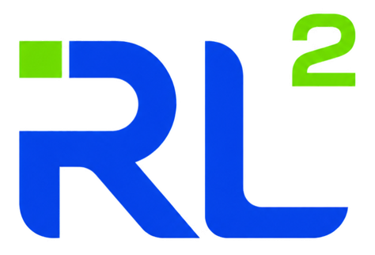
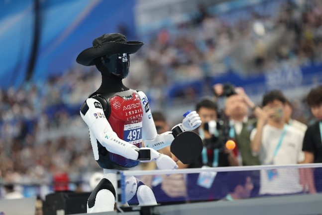
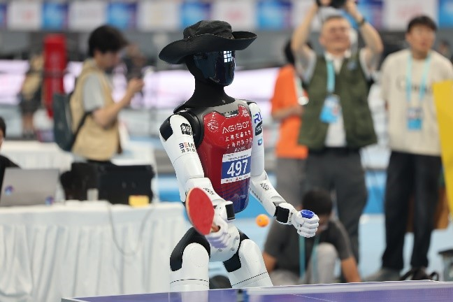
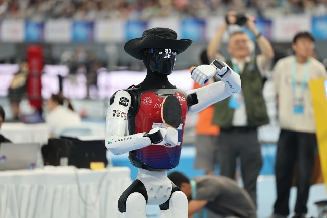

# RL2 PingPong Team 2026

## 关于我们

**RL2 实验室**代表上海交通大学和上海创智学院参加位于北京“冰丝带”国家速滑馆举办的第二届世界人形机器人运动会**乒乓球赛项**，并最终获得季军。

- **团队名称**：上海交通大学/上海创智学院 RL2 战队
- **所属单位**：上海交通大学、上海创智学院
- **指导老师**：高岳教授
- **核心成员**：徐恺阳、张亚洲、张亚洲、沈欣、李金珩、邵开阳、周自豪、汪耀东、夏贤贤、黄恺奕 、朱科祺、刘佳丽

&nbsp;&nbsp;&nbsp;&nbsp;&nbsp;&nbsp;&nbsp;&nbsp;&nbsp;

&nbsp;&nbsp;&nbsp;&nbsp;&nbsp;&nbsp;&nbsp;&nbsp;&nbsp;

## 仓库地图

该组织仓库包含在 Unitree G1 和 Agibot A3 上完成从仿真训练到实机部署的全链路实现。

### 仿真训练

| 仓库 | 说明 |
|---|---|
| `unitree_tennis_lab` | Unitree G1 回球策略的训练 |
| `unitree_agibot_rl_lab` | Unitree G1 和 Agibot A3 行走策略的训练 |
| `unitree_tennis_lab_smash` | SMASH 论文的复现 |
| `unitree_tennis_serve_lab` | Unitree G1 感知发球策略的训练 |
| `table_version_lab` | Unitree G1 和 Agibot A3 回球策略的验证 |
| `unitree_tennis_mjlab` | Unitree G1 回球策略的训练 |
| `agibot_tennis_lab` | Agibot A3 回球策略的训练 |
| `agibot_emoticon` | Agibot A3 语音和表情 |

### 真机部署

| 仓库 | 说明 |
|---|---|
| `unitree_deploy` | Unitree G1 回球策略的部署 |
| `unitree_grasp_racket` | Unitree G1 抓拍标定流程与完整抓拍状态机 |
| `unitree_teleop` | Unitree G1 遥操 |
| `optitrack_pingpong_ws` | 基于球体空气动力学模型的规划器 |

### 视觉感知

| 仓库 | 说明 |
|---|---|
| `vision_windows` | ZED 相机完成机器人本体身与乒乓球定位 |
| `vision_ubuntu` | ZED 相机完成机器人本体身与乒乓球定位 |

### 模型资源

| 仓库 | 说明 |
|---|---|
| `g1_29dof_rev_1_0_bundle` | 带拍子的 Unitree G1 的 URDF |
| `a3_31dof_rev_1_0_bundle` | 带拍子的 Agibot A3 的 URDF |

### 其他

| 仓库 | 说明 |
|---|---|
| `smash_motionVAE` | SMASH 论文的复现 |

## 比赛照片

| 
 Backhand 
 | 
  Forehand 
 |  
 Serve 
 |
|--- | --- | --- |
|  |  |  |

## 联系

如果有任何问题，欢迎联系 passerby_zzz@sjtu.edu.cn 或 Zhangyz2022@sjtu.edu.cn。